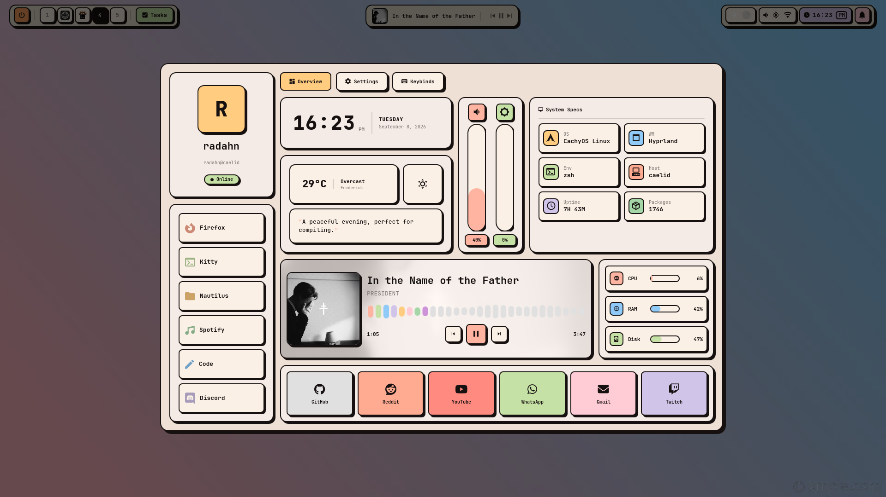
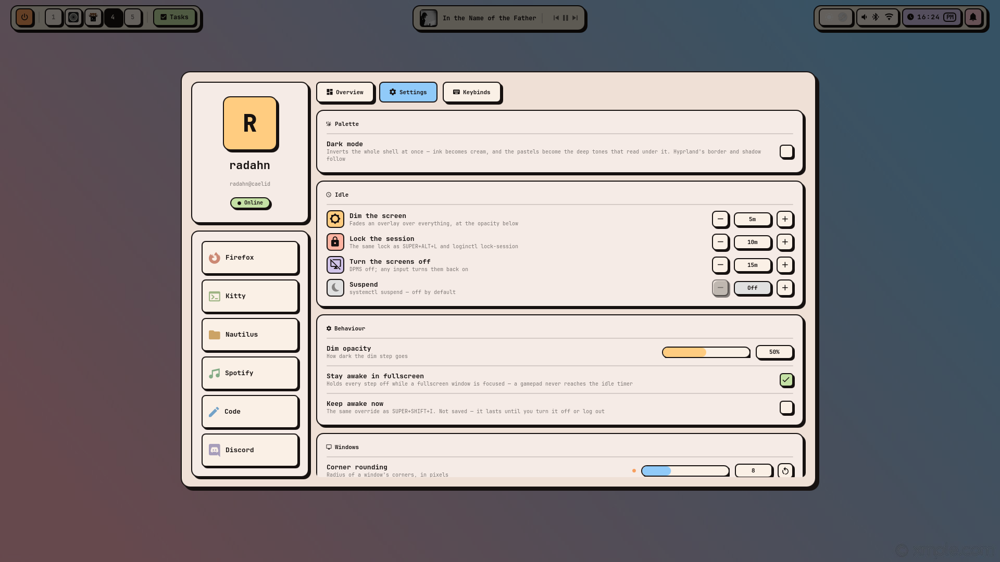
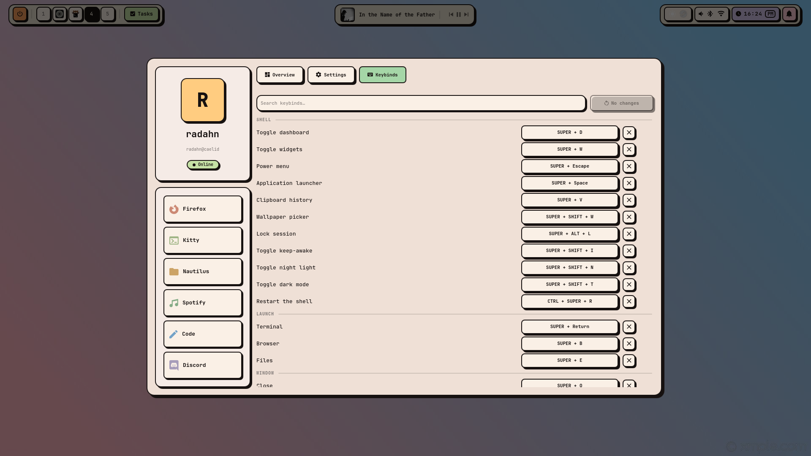
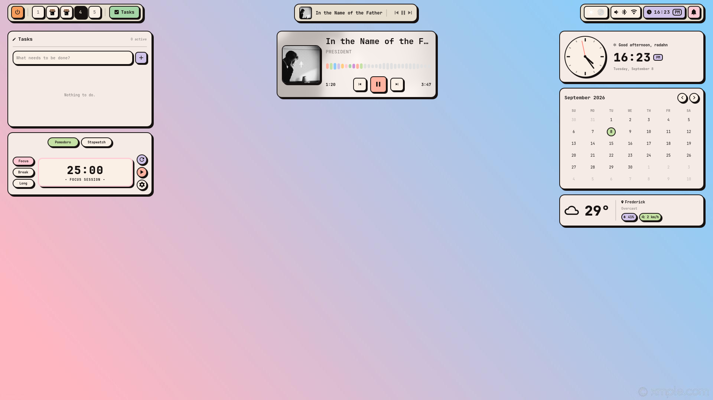
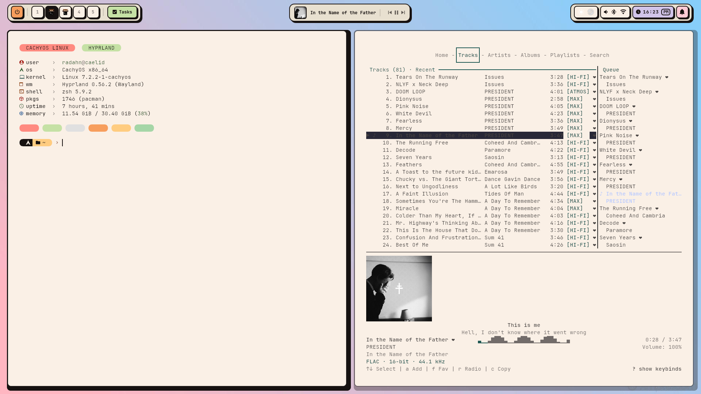

<div align="center">

# BrutalDots

**A neo-brutalist Hyprland desktop, built on [Quickshell](https://quickshell.org).**

Hard 2px borders. Solid offset shadows, never blurred. Flat pastel blocks on warm linen.

</div>

---

## What this is

A complete Wayland desktop for Hyprland — bar, application launcher, clipboard
history, control-centre dashboard, desktop widgets, notifications, OSD, system
tray, polkit prompts, idle handling, lock screen, screenshots and recording —
all written in QML against Quickshell, with a single design-token file driving
the whole look.

The point of doing it all in the shell is that there is one config file, one
theme, and one process to restart. There is no `hyprlock.conf` to keep in step
with the palette, no `hypridle.conf` whose timings disagree with the lock, no
separate polkit agent in somebody else's widget toolkit, and no launcher that
looks like it came from a different desktop:

| Instead of | BrutalDots uses |
| --- | --- |
| `hyprlock` | `Modules/Lock` — the Wayland session-lock protocol, PAM for auth |
| `hypridle` | `Services/Idle` — Wayland idle-notify, dim → lock → screen off → suspend |
| `polkit-kde-agent` / `polkit-gnome` | `Modules/Polkit` — registers as the session's agent |
| `swww` / `hyprpaper` / `swaybg` | `Modules/Wallpaper` — a background-layer surface, with a picker |
| `fuzzel` / `rofi` / `wofi` | `Modules/Launcher` — apps, `>` commands, clipboard history |
| `waybar` + a tray plugin | `Modules/Bar` — tray icons and their DBus menus, redrawn |

The visual language follows [Darkkal44's **Bruteon**](https://github.com/Darkkal44/Bruteon)
concept. Bruteon's dotfiles have not been published, so this is a clean-room
implementation built from the design: the palette, geometry and component
inventory were derived from the published preview images, and all code here is
original. Credit for the design direction goes to Darkkal44; bugs are mine.

## Preview



| | |
| --- | --- |
|  |  |
|  |  |

Toggle the surfaces with `SUPER+Space` (launcher), `SUPER+D` (dashboard),
`SUPER+W` (widgets), `SUPER+V` (clipboard) and `SUPER+ESC` (power menu).

## Requirements

| Required | Why |
| --- | --- |
| `quickshell` (≥ 0.2) | the shell runtime |
| `hyprland` (≥ 0.50) | compositor; the bar uses its IPC for workspaces |
| **JetBrainsMono Nerd Font** | every glyph in the UI comes from it |

These are installed for you if they are missing — the list is what the desktop
*is*, not a menu:

| Installed for you | Enables |
| --- | --- |
| `zsh` | the shell the prompt and fetch are wired into |
| `playerctl` / any MPRIS player | now-playing capsule and media widget |
| `cava` | the level meter in the mini player |
| `brightnessctl` | brightness slider and OSD (hidden without a backlight) |
| `wireplumber` (`wpctl`) | volume keybinds |
| `cliphist` + `wl-clipboard` | clipboard history (`SUPER+V`) |
| `grim` + `slurp` | screenshots |
| `satty` or `swappy` | annotating a shot before it is saved |
| `wf-recorder` | screen recording |
| `hyprpicker` | colour picker |
| `hyprsunset` | night light |
| `curl` | weather |
| `kitty` | the terminal the shell launches, themed to match, light and dark |
| `starship` | the shell prompt, themed to match |
| `nautilus` | the file manager `SUPER+E` and the dashboard Files tile open |
| `xdg-utils` | dashboard quick links |
| `gnome-keyring` | secret storage for apps that expect a keyring |

The installer installs whatever of this is missing, in one `pacman`
transaction. That is not optional — these dotfiles are opinionated about what
the desktop contains, and a fresh setup should come up complete rather than
half-lit. Install the packages yourself beforehand and there is nothing left
for it to do.

The runtime guards remain regardless: every startup command and every shell
action checks for its tool first, so a feature whose tool is removed later
switches itself off instead of erroring.

On Arch:

```sh
sudo pacman -S quickshell hyprland ttf-jetbrains-mono-nerd \
               playerctl cava brightnessctl wireplumber curl xdg-utils \
               cliphist wl-clipboard grim slurp satty wf-recorder \
               hyprpicker hyprsunset starship
```

## Trying it without touching your setup

Nothing here has to be installed to be run. Three options, least invasive first.

### 1. Nested compositor — fully isolated

```sh
./scripts/test-nested.sh
```

Opens a Hyprland inside a window on your current desktop, with BrutalDots
running in it. The nested session has its own workspaces, its own layer-shell
surfaces and its own exclusive zones, so your real windows never move. Quit it
with `SUPER+SHIFT+E`.

Add `--isolated` to give the nest a private D-Bus session. That is the only way
to test **notifications** while another shell is already running, since two
shells cannot both own `org.freedesktop.Notifications`. The trade-off is that
MPRIS is session-bus scoped too, so players on your host desktop won't show up
in the nested instance.

### 2. Run it over your live session, reserving no space

```sh
BRUTALDOTS_PREVIEW=1 qs -p ./quickshell/brutal
```

Runs straight from the repo — no install, no symlink, no Hyprland changes.
`BRUTALDOTS_PREVIEW=1` stops the bar claiming an exclusive zone, so it draws on
top of your desktop without pushing every window down. `Ctrl-C` to stop.

This is the fastest loop for iterating on layout, but the bar will overlap
whatever is already at the top of your screen.

### 3. Run it normally, from the repo

```sh
qs -p ./quickshell/brutal
```

Same thing with the exclusive zone active, so you can check spacing for real.
Your windows shift down while it runs and return when you stop it.

> Quickshell configs are namespaced by directory, so even a full install
> (`qs -c brutal`) sits alongside any other Quickshell config you run. The only
> shared, single-owner resource is the notification D-Bus name.

In both of the above the shell runs next to whatever shell you already have, so
three single-owner things go to whoever claimed them first — the notification
daemon, the polkit agent, and the tray watcher. BrutalDots logs a warning and
carries on. Idle handling and the automatic lock are disabled outright under
`BRUTALDOTS_PREVIEW=1`, so it can't dim your screen or throw a second lock
screen over your session.

### 4. A second session entry — the whole desktop, nothing installed

The most complete way to try it without changing a single file in
`~/.config`. Add a login-screen entry that points Hyprland straight at the
checkout:

```sh
sudo mkdir -p /usr/local/share/wayland-sessions
sudo tee /usr/local/share/wayland-sessions/brutaldots.desktop >/dev/null <<EOF
[Desktop Entry]
Name=BrutalDots
Comment=Neo-brutalist Hyprland
Exec=/usr/bin/Hyprland -c $PWD/hypr/hyprland.lua
Type=Application
DesktopNames=Hyprland
EOF
```

Log out, pick **BrutalDots** from the session list, and you get the real thing:
your actual monitors, the real bar with exclusive zones, the tray, the lock
screen, idle handling, all of it. To go back, log out and pick your usual
session — nothing was changed to undo.

No second step is needed to make the shell start: `execs.lua` launches
`qs -c brutal` when the shell is installed, and otherwise launches the copy
sitting beside the config it was loaded from.

Two things to know about this mode:

- Hyprland resolves `custom/` relative to the config it loaded, so it reads
  `<checkout>/hypr/custom/`, not `~/.config/hypr/custom/`. Your existing
  autostarts and overrides will not run. That is usually what you want for a
  first look; copy the files across if you would rather have them.
- Editing files in the checkout edits the running session, which is either
  convenient or alarming depending on the day.

Delete the entry with `sudo rm /usr/local/share/wayland-sessions/brutaldots.desktop`.

## Install

```sh
curl -fsSL https://raw.githubusercontent.com/fezzik-the-giant/BrutalDots/main/install.sh | bash
```

That fetches the repository into `~/.cache/brutaldots/checkout` and runs the
installer out of it — the script is not self-contained, it needs the
configuration and its own modules beside it. Re-running updates that checkout
first. Arguments go after `bash -s --`:

```sh
curl -fsSL .../install.sh | bash -s -- --yes
```

Or clone it yourself, which is the same thing without the indirection and lets
you read the script before it runs as you:

```sh
git clone https://github.com/fezzik-the-giant/BrutalDots.git
cd BrutalDots
./install.sh          # pick what to install from a checklist
```

The installer asks which parts you want. The Hyprland and Quickshell
configuration is always installed — it is what this repo *is* — and everything
else is a choice. Only the login screen writes outside your home directory. It
and the package install are the two things that ask for a password, and both
say so before they do it.

The installer also makes zsh your login shell, since that is the shell the
prompt and the fetch are wired into, and writes a small `~/.zshrc` if you do not
already have one. An existing one is never overwritten. To undo just that part:
`chsh -s /bin/bash`.

The configuration is **copied** into place, so the checkout is yours to delete
afterwards. Pass `--link` to symlink it out of the repo instead — edits then go
live immediately, which is what you want if you are working *on* BrutalDots.
Clone it yourself for that; linking against the cache directory above would
point your live shell at something the installer overwrites on its next run.

Pass `--yes` to take the defaults without being asked. With no terminal to draw
on — piped, or in a script — the checklist is skipped and the defaults apply.
Re-running keeps what you already have: if the greeter is installed, it stays
ticked.

### Going back

```sh
./install.sh --uninstall
```

Puts the newest `~/.config/hypr.bak.*` back, and removes
`~/.config/quickshell/brutal`. Name a specific snapshot to restore that one
instead: `./install.sh --uninstall ~/.config/hypr.bak.20260101120000`.

Nothing is deleted outright — the BrutalDots config it replaces is moved to
`~/.config/hypr.brutaldots.<timestamp>`, and a `~/.config/quickshell/brutal`
that is a real directory rather than a symlink is moved aside too. Your
`~/.config/brutaldots/` settings are left alone, so reinstalling later picks up
where you left off.

Log out and back in afterwards. Hyprland reads its config once at startup, so a
restored config does not take effect until the compositor restarts.

BrutalDots ships a complete Hyprland configuration. The installer snapshots the
whole of `~/.config/hypr` first, then replaces only `hyprland.lua` and
`hyprland/` — everything else, `custom/` included, is left alone. Any
`hyprlock.conf` or `hypridle.conf` you already have stays on disk but stops
being used: BrutalDots does its own locking and idle handling, and neither
daemon is started. To roll back:

```sh
rm -rf ~/.config/hypr && cp -a ~/.config/hypr.bak.<timestamp> ~/.config/hypr
```

Then start the shell:

```sh
qs -c brutal
```

Quickshell configs are namespaced by directory, so `brutal` coexists with any
other Quickshell config you already run — nothing is overwritten, and you can
switch by changing which one you launch.

### Hyprland config format

BrutalDots uses Hyprland's **Lua** config format. Hyprland 0.56 prints this on
startup for the older format:

> You are using the .conf config format, support for which will be removed in
> Hyprland 0.57.

If you still have a `hyprland.conf`, remove or rename it after installing so
Hyprland picks up `hyprland.lua`.

Your own changes go in `~/.config/hypr/custom/`. Each of `env.lua`, `execs.lua`,
`general.lua`, `rules.lua` and `keybinds.lua` is loaded after the defaults if it
exists, so your overrides survive an update. `custom/execs.lua` is for your own
autostarts — `hl.on("hyprland.start")` handlers stack, so it runs alongside the
shell launch rather than replacing it.

#### Keybind overrides

`custom/keybinds.lua` does double duty. Anything you write in it is loaded after
the defaults, as above — but it can also carry a block the dashboard's **Keybinds**
tab owns:

```lua
-- >>> BrutalDots keybinds (managed by the dashboard) >>>
BRUTALDOTS_KEYBINDS = {
    ["shell.dashboard"] = "SUPER + ALT + D",
    ["window.pin"]      = "",   -- bound to nothing
}
-- <<< BrutalDots keybinds <<<
```

`hyprland/keybinds.lua` reads that block as text *before* it registers anything,
so an override replaces its default rather than being bound alongside it — there
is no `unbind` involved and no combo ends up firing two actions. Ids come from
the catalogue that same file exports to
`~/.local/state/brutaldots/keybinds-catalogue.json`.

Rebinding in the tab rewrites only the block; everything you wrote around it is
kept exactly as it was. Editing the block by hand works too. Deleting it — or
pressing **Reset** in the tab — restores every default.

> [!NOTE]
> Overrides win, including ones written for a different rice. A `custom/`
> carried over from another setup can quietly fight the theme — `dim_inactive`
> and opacity settings are the usual culprits, since BrutalDots turns them off
> on purpose.

### Dark mode

`SUPER + SHIFT + T`, the Palette card in the dashboard's Settings tab, or
`qs -c brutal ipc call shell darkMode`. One toggle moves the shell, Hyprland's
window frame, every open kitty, the login screen and your GTK applications at
once, and the choice is remembered in `settings.json`.

That last one is a single `gsettings` write. `color-scheme` is what libadwaita
reads, and xdg-desktop-portal republishes it as `org.freedesktop.appearance`,
which is where Qt 6, Electron and Firefox get their answer — so one key reaches
far more than GTK, and there is no qt5ct/qt6ct handling for that reason. GTK3
applications that predate libadwaita follow the theme *name* instead, so
`gtk-theme` is adjusted as well: the shell takes whichever theme you already
have, adds or strips a `-dark` suffix, and switches only if that variant is
installed. A theme with no counterpart is left alone rather than replaced.

Set `theme.syncApps` to `false` in `settings.json` to leave your GTK settings
entirely alone; everything else still follows the toggle.

It inverts the **neutrals** and nothing else. `ink` becomes the cream and the
surfaces become warm near-blacks, but the accents do not move: the same pastels
are used in both modes, and what flips is the ink drawn on top of them.

It did invert the accents once, into deep tones dark enough to carry cream text.
That was a tidier rule and it looked worse — a fill dark enough for cream ink is
a fill with the life drained out of it, so every accent in dark mode came out
muted. They now sit between **5:1 and 13:1** against the surface behind them,
where the deep set managed 1.45–2.25:1.

The cost is that a component drawing on a coloured fill can no longer assume
`color.ink`. `BrutalBox` exposes `onColor` — the ink that reads on its own fill,
measured rather than looked up, so it is right for a pastel accent, a near-black
surface, or a hover state part-way between two colours. `BrutalText` and
`BrutalIcon` walk up to the nearest enclosing box and use it automatically.

That inheritance is deliberate rather than a value threaded through each call
site. A fill is often a conditional (`open ? mint : green`), and a component
that hard-codes `Theme.color.ink` on a coloured fill is only wrong in one mode,
so it survives review — the first two attempts at this change missed sites for
exactly that reason. Making the default correct removes the class. Set `color`
explicitly to override, which is needed only when the thing drawn is not on its
ancestor box at all: a day number sitting over a sibling "today" dot, or the
clock's inverted AM/PM chip.

The shadow does not follow the ink either, for the same underlying reason — see
`Theme.shadow`. A cast shadow has to be darker than what it falls on, and in
dark mode `ink` is the cream.

A handful of places use an accent as a *mark* — the alert glyph next to a bad
idle ladder, the clock's second hand, the recording light in the bar — where the
colour is the thing being drawn rather than a block behind it. Those read
`Theme.mark`, which is now identical to `Theme.color`'s accents and kept because
the distinction it names is still real: a mark contrasts with the surface behind
it, a fill carries ink on top of it.

Hyprland's border and shadow are pushed over with `hyprctl eval` — `keyword`
refuses to touch a Lua config — and are re-pushed at shell startup, since
`hyprctl reload` drops them. kitty is handled by rewriting a one-line pointer
and sending `SIGUSR1`; see below.

### Terminal

kitty is the terminal the shell launches by default, so its colours ship here
too. Installing writes `~/.config/kitty/brutaldots.conf` and appends one line to
your `kitty.conf`:

```
include brutaldots.conf
```

At the **end**, deliberately. kitty applies settings in order and the last one
wins, so the theme overrides whatever colours came before it — including one
left behind by another rice — while your font, padding, keybinds and kittens
above it are untouched. An existing `kitty.conf` is never replaced; if you have
none, a starter is written that already includes the theme. The whole
`~/.config/kitty` is copied to a `.bak.<timestamp>` first either way.

`brutaldots.conf` sets colours and nothing else, on purpose. It holds none
itself, either — it is a pointer:

```
~/.config/kitty/
  brutaldots.conf         included by your kitty.conf; includes the two below
  brutaldots-light.conf   the cream palette
  brutaldots-dark.conf    the near-black one
  brutaldots-mode.conf    which is live: one include for dark, nothing for light
```

Toggling dark mode rewrites `brutaldots-mode.conf` and sends every running kitty
`SIGUSR1`, which is how kitty is told to re-read its config — so terminals you
already have open change with everything else rather than on their next launch.
Nothing is written unless `brutaldots.conf` is already sitting there, so a setup
that took the shell but kept its own terminal colours is never touched. Doing
this over a socket would mean turning kitty's remote control on, and a colour
scheme is not a good reason to open a control channel into every terminal you
own.

`brutaldots.conf` includes the light palette first and unconditionally, then the
pointer. A pointer that has gone missing or been truncated therefore costs you
the mode rather than the theme: kitty skips an include it cannot find, and would
otherwise drop to its own defaults — a black terminal with none of this in it.

That is also why the pointer is asymmetric. It holds `include
brutaldots-dark.conf` for dark and **nothing at all** for light, because by the
time it is read the light palette is already in: kitty treats a second include
of the same file as a configuration error and says so in a dialog, rather than
quietly ignoring it. So light is the absence of a line, not a line naming light.

The palettes are derived from `Theme.qml`, but not copied from it. The shell
uses those pastels as *fills*, with ink text drawn on top; in a terminal the
same hues become the text itself. On the cream background each one is pulled
down to a readable tone. Every one of the sixteen clears WCAG 4.5:1 against the
background — the darkest sits at 16.6, the lightest at 4.54 — so nothing in the
palette can render as invisible text. Bright variants are the same hue as their
normal counterpart, one step lighter.

> [!NOTE]
> On a light background there is no such thing as a readable yellow, so
> `color3` is an amber and `color11` an orange. Light themes all make this
> trade; Solarized Light's yellow is the same idea.

The greyscale runs dark to light as black, bright white, white, bright black,
which reads backwards from the names. It is the only ordering that works here:
"bright white" has to be dark enough to see, and "bright black" is what programs
reach for when they mean dim.

`brutaldots-dark.conf` is the mirror of all of that, and needs almost none of
it. On a near-black background the pastels are already the readable end of the
ramp, so they are used as they are — every chromatic entry clears 4.5:1, most by
a wide margin — and the greyscale runs in the order the names suggest. The one
entry worth knowing about is `color8`, kept above 4.5:1 rather than left as a
true grey, because it is what programs reach for when they mean dim.

Re-running the installer never moves you back to light. It preserves the *mode*
rather than the file — it reads which palette the pointer names, then rewrites
it in the current format, which is also how a pointer written by an older
version is migrated.

### Prompt

`.config/starship.toml` themes the shell prompt to match, as a row of rounded
pills — the same shape `BrutalPill` draws in the bar and the dashboard.

```
 󰣇  󰉋 …/BrutalDots   󰘬 main   !2 +1 ?4   󰔟 4s  󰅂
```

A pill is really one glyph, a run of background, and another glyph: the caps
are `U+E0B6` and `U+E0B4` from the Nerd Font. The distro mark and the directory
share a single shape in two colours, which is why the first pill has no right
cap. The rest appear only when they have something to say: a clean tree shows
no status pill, a fast command no duration, a successful one no exit code.

Colour is **always** a background here, never text. That is the same rule the
shell follows, and in a terminal it is also a legibility floor: `#90CAF9` as
text on cream is 1.7:1 and unreadable, while the same blue as a fill under
`#161110` ink is 12:1.

One file serves both light and dark mode, and that falls out of the same rule
rather than being worked for. A pastel block with ink on it is legible whatever
is behind it, so every pill is already mode-proof. Only the caps and the prompt
arrow touch the terminal's own background, and they use ANSI *indices* rather
than names — index `3` is `#883900` on the light palette and `#F79E5D` on the
dark one, so the arrow is always the readable end of its hue.

> [!NOTE]
> The prompt mark is `Icons.chevronRight`, the same glyph the bar and the
> dashboard use. Every glyph in this file was checked against JetBrainsMono
> Nerd Font in Regular *and* Bold, which matters more than it sounds: the
> obvious `➤` (U+27A4) is **not** in the font, and a missing glyph falls
> through to whatever fontconfig picks next — rarely a cell-width face, which
> knocks every pill on the line out of alignment.

> [!NOTE]
> Index `1`, not the name `red`. The palette below defines its own `red`, and a
> palette entry shadows starship's built-in name for the whole file — so
> `bold red` there quietly resolves to the pastel, which is exactly the thing
> that must never be a foreground. Numeric indices cannot be shadowed.

The `[palettes.brutaldots]` table at the top is the whole theme. Every colour
below refers to it by name, so retheming the prompt means editing that table
and nothing else. There is no dark counterpart to it and no need for one: `ink`
is only ever used on top of one of those blocks, never on the terminal itself.

> [!NOTE]
> Unlike kitty, starship has no `include`, so this is the entire config rather
> than a fragment layered over yours. Your existing `starship.toml` is copied to
> `starship.toml.bak.<timestamp>` before it is replaced, and `--uninstall` tells
> you where. If your shell had no `starship init` line, one is appended to
> `.zshrc` / `.bashrc` (backed up first), guarded so it stays harmless if you
> remove starship later.

Every glyph in the prompt was checked against JetBrainsMono Nerd Font in both
weights, because a missing one falls through to whatever fontconfig picks next
and that font is rarely cell-width — which knocks the block edges out of
alignment. Without any Nerd Font installed the icons render as boxes; the
installer says so rather than leaving you to wonder.

### Fetch

`.config/fastfetch/config.jsonc` is the banner a new terminal opens on.

```
 CACHYOS LINUX   HYPRLAND

󰀉 user    ›  fezzik@caelid
󰣇 os      ›  CachyOS x86_64
󰌢 kernel  ›  Linux 7.2.2-1-cachyos
󰖯 wm      ›  Hyprland 0.56.2 (Wayland)
󰆍 shell   ›  zsh 5.9.2
󰏗 pkgs    ›  1744 (pacman)
󰅐 uptime  ›  5 hours, 9 mins
󰍛 memory  ›  5.82 GiB / 30.40 GiB (19%)

     
```

The glyphs are `Config/Icons.qml`'s, so the fetch names things with the same
vocabulary the bar and the dashboard use.

Two kinds of colour appear in that file and they are chosen on different
grounds. The pills and the swatch row are **truecolour** pastels with a fixed
ink on them — the same argument the prompt makes, and what lets one file serve
both modes. Everything else uses ANSI **indices**, because the two kitty
palettes are inverted in lightness on purpose: light mode's `color1` is
`#a50d00`, dark mode's is `#FF8A80`. An index is therefore always the readable
end of its hue against whatever background is current, while naming a colour
would pin the file to one mode.

The installer adds a guarded three-line block to your shell rc to run it. The
guard is `case $- in *i*)`, so non-interactive shells — `scp`, `rsync`, and
anything scripted — never see it. Deleting those three lines is the whole
opt-out.

The `pkgs` row names `pacman` explicitly. `{all}` would read
"8 (flatpak-system), 6 (flatpak-user), 1744 (pacman)", because fastfetch counts
every backend it can find.

### Editor

`.config/nvim/` is a colourscheme, a shared palette module and a lualine theme. Three
additive files — nothing touches your `init.lua`, and a colourscheme dropped
into `colors/` is inert until something asks for it.

```lua
vim.cmd.colorscheme("brutaldots")
require("lualine").setup { options = { theme = "brutaldots" } }
```

The syntax colours are not invented for the editor. They are the two kitty
palettes from `.config/kitty/brutaldots-{light,dark}.conf`, which were already tuned for
exactly this job — coloured text on that background — so nvim and the terminal
around it cannot drift apart. The surfaces are `Config/Theme.qml`'s: `Normal`
sits on the colour kitty paints, so the editor blends into its own terminal;
floats are one step raised and sidebars one step recessed, which is the shell's
`base` / `surface` / `mantle` / `crust` ramp doing its usual job.

**It follows the toggle live.** `settings.json` is the source of truth and it is
*watched*, not read once, so flipping dark mode repaints an already-open editor
the same way it repaints an already-open kitty. The watcher re-arms itself on
every event, because a writer that replaces a file rather than writing through
it — which is what an atomic save is — leaves the original watch pointing at an
inode that no longer exists.

Without a `settings.json` it falls back to `background`, so the colourscheme is
still useful on a machine that has it but not the rest of the rice.

### Startup

`hyprland/execs.lua` launches the shell and the session plumbing a desktop
needs. Every line is conditional — a missing tool is skipped, not fatal.

| Started | Notes |
| --- | --- |
| the shell | also the notification daemon, polkit agent, lock screen and idle handler; found next to the config when nothing is installed |
| `dbus-update-activation-environment` | without it screen sharing hands the portal a black frame |
| `gnome-keyring-daemon` | only if installed |
| `wl-paste --watch cliphist store` | one watcher for text, one for images |
| a `gdbus` listener on logind | see below |
| `hyprsunset` | idle at 6000K until the night-light toggle moves it |
| `hyprctl setcursor` | only if the theme directory exists |

**Lock on request and before sleep.** `loginctl lock-session` and suspend both
announce themselves on the system bus. A small `gdbus monitor` loop watches for
`Session.Lock` and `PrepareForSleep` and calls the shell's `lock` IPC, so the
usual ways of locking a session all end up at the same lock screen. `gdbus`
ships with glib2 and can subscribe as a normal user, which `dbus-monitor`
cannot — no privileges are needed.

### Audio

The speaker glyph in the right island opens an audio pane: output and input
levels with mute toggles, and both device lists. Output and input are separate
because they are separate decisions — picking a headset to listen through and
picking its microphone are two different PipeWire nodes.

The active device sits at the top of each list with a tick, the rest
alphabetical; a machine with HDMI, USB and every headset it has ever seen can
list a dozen, and the one you are listening through should never be the one you
have to scroll to. Application streams are deliberately absent — routing an
individual stream belongs in a mixer, not a bar menu. The lists scroll once
they outgrow the panel.

**Middle-click** the glyph mutes outright without opening anything, matching
the bluetooth glyph beside it; the scroll wheel still changes volume without
opening anything either.

```sh
qs -c brutal ipc call shell audio            # open the pane
qs -c brutal ipc call shell setSink "G733"   # switch by name, for a keybind
qs -c brutal ipc call shell setSource "Razer"
```

### Wi-Fi

The Wi-Fi glyph in the right island opens a network list under the bar: power
the radio, scan, and join or leave. Networks are grouped connected → saved →
everything else, each group by descending signal, so the row you are reaching
for does not swap places with its neighbour as the numbers wobble.

A saved or open network joins on one click. Anything else opens a passphrase
field **in the row itself** rather than stacking a second window on the menu.
Right-click a saved network to forget it.

> [!NOTE]
> `WifiNetwork.connect()` takes no arguments, so there is no way to hand a
> passphrase to it from QML. Joining a new secured network shells out to
> `nmcli --ask` and writes the passphrase to its stdin — a password passed in
> `argv` is readable by every process on the machine for as long as the command
> runs. It is held in memory only between the click and nmcli asking for it.

Scanning runs only while the menu is open, and the half-typed passphrase is
dropped when it closes. If an rfkill switch has the radio off, the toggle is
disabled rather than offered and ignored — nothing in software can undo it.

**Middle-click** the glyph to flip the radio outright, matching the bluetooth
glyph beside it. `qs -c brutal ipc call shell wifi` opens it from a script.

### Bluetooth

The bluetooth glyph in the right island opens a device menu under the bar:
power the adapter, scan, and connect or disconnect. Devices are grouped
connected → paired → merely seen, each group alphabetical, so a scan turning up
new devices never reshuffles the ones you were aiming at. Connected devices
that report a battery show it.

An unpaired device pairs on first click and connects after — BlueZ will not
connect to a device it has never paired with. Scanning runs only while the menu
is open and is always handed back on the way out.

**Middle-click** the glyph to flip the radio outright without opening anything;
left click no longer toggles it, because reaching for a headset and killing
bluetooth instead is a bad surprise. Escape or a click elsewhere closes the
menu, and `qs -c brutal ipc call shell bluetooth` opens it from a script.

### Idle, and why games used to dim

`Services/Idle` runs four independent steps off Wayland's idle-notify protocol:
dim, lock, screen off, suspend. Each has its own timeout in `settings.json`, and
`0` turns that step off.

The catch is that the idle timer only resets on input the **compositor** routes.
A gamepad does not go through the compositor at all — the game reads it straight
off evdev — so a controller session looks completely idle to Hyprland, and the
screen dims mid-play and then locks a few minutes later. Video players avoid
this by taking a real idle inhibitor, which `respectInhibitors` already honours;
games almost never do.

So `inhibitFullscreen` (on by default) holds all four steps off while a
fullscreen window is focused. It is scoped to the *focused* workspace
deliberately: a fullscreen game left running on another workspace should stop
keeping the machine awake once you have moved on from it.

This does not cover a **windowed** game played on a controller — there is no
fullscreen window to detect. For that, `SUPER+SHIFT+I` toggles the manual
keep-awake, which shows a coffee pill in the bar so it is not left on by
accident.

### Now playing

The bar's centre island is the now-playing capsule. **Click it** and it expands
into a mini player hanging directly under the bar: art, track, a live level
meter, a seek bar and transport. Escape or a click anywhere else puts it away.

The meter is `cava`, reading the **output device** rather than the player — so
it moves for anything audible, including a video in a browser tab that
publishes no MPRIS metadata at all. cava is started only while the panel is on
screen and stopped the moment it closes; a 60fps process polling the audio
device is not worth its battery cost for a panel nobody has open.

```jsonc
"media": {
  "visualizer": true,
  "visualizerBars": 28,
  "visualizerSmoothing": 20   // cava's noise_reduction
}
```

cava takes settings only from a file, so one is generated at
`~/.local/state/brutaldots/cava.conf` from the values above and rewritten when
they change. Without cava installed the mini player still works — the meter
simply hides rather than showing a dead flat line.

`qs -c brutal ipc call shell media` toggles it from a script.

### Wallpaper

The shell draws it, on a background-layer surface it already owns, so there is
no `swww`, `hyprpaper` or `swaybg` daemon to install and autostart — and no
second place where the current wallpaper is recorded.

**`SUPER+SHIFT+W` opens the picker**: a grid of everything in your wallpaper
directory, filtered as you type, applied on Return or a click. It opens on the
wallpaper already in use, ticks it in the grid, and writes your choice to
`settings.json` — so the picker, the backdrop and the config file can never
disagree about what is on screen. `Shift+Backspace` on an empty search box goes
back to the generated pattern.

```jsonc
"wallpaper": {
  "path": "~/Pictures/whatever.png",       // blank = the generated pattern
  "mode": "fill",                          // fill | fit | stretch | center | tile
  "directory": "~/Pictures/Wallpapers"     // what the picker lists
}
```

The directory and its immediate subfolders are scanned for `png`, `jpg`, `jpeg`, `webp`,
`bmp`, `gif` and `avif`. Tiles and the backdrop both decode at the size they
are actually drawn at, so a folder of 4K photos costs texture memory in
proportion to your screen rather than to the files.

`~` and `$HOME` are expanded. `~/.config/brutaldots/wallpaper` and
`$BRUTALDOTS_WALLPAPER` are honoured when `path` is blank. Settings are
watched, so hand-editing the file applies the moment you save.

**With no image**, it paints a themed backdrop rather than leaving you with a
black screen: the linen ground with a faint ink grid over it. `pattern` takes
`grid`, `dots`, `diagonal` or `solid`, with `patternSpacing` and
`patternOpacity` to tune it. The default is deliberately quiet — the desktop is
the one surface in this design that is not competing for attention.

Video wallpapers are not supported: the backdrop is an `Image`, so video
extensions are deliberately left out of the picker. If you want them, set
`wallpaper.enabled` to `false` so the shell leaves the layer alone, and start
`mpvpaper` from `custom/execs.lua`.

You can also drive it from a script:

```sh
qs -c brutal ipc call shell wallpaper                          # open the picker
qs -c brutal ipc call shell setWallpaper ~/Pictures/other.png  # set one directly
```

## Layout

```
hypr/
├── hyprland.lua         main config — Hyprland loads this directly
└── hyprland/
    ├── env.lua          environment variables
    ├── execs.lua        startup: shell, portals, clipboard, lock bridge, wallpaper
    ├── general.lua      monitors, frame, motion, input
    ├── rules.lua        window and layer rules
    └── keybinds.lua     window management, workspaces, shell, media keys

quickshell/brutal/
├── shell.qml            entry point: surfaces, IPC handlers, global shortcuts
├── Config/
│   ├── Theme.qml        every colour, radius, border, shadow and type size
│   ├── Icons.qml        named Nerd Font glyphs
│   ├── Settings.qml     user config, persisted as JSON
│   └── Env.qml          launch-time flags read from the environment
├── Components/          the brutalist primitives (box, button, pill, slider…)
├── Services/            system state: audio, network, mpris, weather, tasks…
└── Modules/
    ├── Bar/             three floating islands, tray, tray menus
    ├── Launcher/        apps, `>` commands, clipboard history
    ├── Media/           the mini player, with a cava level meter
    ├── Audio/           the device pane under the right island
    ├── Bluetooth/       the device menu under the right island
    ├── Wallpaper/       the desktop background, and the picker
    ├── Dashboard/       the control centre
    ├── Widgets/         desktop widgets
    ├── Common/          pieces shared between surfaces
    ├── Notifications/   toasts and history
    ├── Osd/             volume and brightness overlay
    ├── Lock/            session lock and the pre-lock dim
    ├── Polkit/          authentication prompts
    └── Power/           session menu
```

### The design system

Everything visible is built from `BrutalBox` — an opaque panel with a 2px
`#161110` border and a solid shadow offset down-right, drawn as a plain
rectangle behind the surface rather than a blur. `BrutalButton` presses *into*
that shadow: on click the surface translates by exactly the shadow offset and
the shadow disappears, so it reads as pushed flat against the page.

Colours are Material 100–200 pastels over a linen base. Change
`Config/Theme.qml` and the entire shell follows — no module hard-codes a colour.
That includes the lock screen and the polkit prompt, which is the main reason
they are built here rather than delegated to `hyprlock` and a KDE dialog.

It is also what makes [dark mode](#dark-mode) a swap of one palette object for
another rather than a second stylesheet: `#161110` above is `Theme.color.ink`,
and after dark it is the cream instead.

### The lock screen

The lock is a `WlSessionLock` client authenticating against PAM
(`/etc/pam.d/login` by default; change `lock.pamConfig` to use another). Two
consequences worth knowing:

- If the shell crashes while locked, the compositor **keeps the session
  locked** behind a blank surface. That is the protocol working as intended —
  a crashed locker must never expose the desktop.
- If PAM is misconfigured the lock cannot let you back in. Before relying on
  it, lock once from a nested test session
  (`./scripts/test-nested.sh`, then `SUPER+ALT+L`) and check your password is
  accepted there.

### The login screen

The SDDM greeter is the lock screen — not a lookalike. `Theme.qml`, `Icons.qml`
and the `Brutal*` components import nothing but `QtQuick` and `qs.Config`, so
the installer copies them out of the shell with that one import line removed
and builds a standalone Qt6 theme around them. Only `Main.qml` is written
twice, because a greeter has to choose a user and a session where the lock
screen already knows both.

Tick it in the checklist, or:

```bash
./install.sh --test-sddm   # open it in SDDM's own greeter, in a window.
                           # No privileges, changes nothing. Do this first.
./install.sh --uninstall   # put back the theme it replaced
```

`scripts/test-sddm.sh` drives the greeter under QtTest with stand-ins for
SDDM's context objects, which is the only way to exercise a login screen
without logging out.

**Dark mode follows the session.** Toggle the shell and the login screen
follows; log out in dark and it comes back dark.

The greeter runs as the `sddm` user and cannot read your home directory, so it
never sees `settings.json` — but it does read its own `theme.conf`, and SDDM
re-reads that at every greeter start. So the installed `theme.conf` is not kept
in the root-owned theme directory: the real file is `/var/lib/brutaldots/theme.conf`,
owned by you, with a symlink to it from the theme. `Services/Greeter.qml`
rewrites one line of it on every toggle. Its starting value is seeded from
whatever mode your session is in when you install, so there is nothing to
choose — toggle the pair with `SUPER + SHIFT + T`.

That file is also where `message=` and `label=` live, and the shell only ever
touches the `dark=` line. It is writable by you and read by the greeter, which
is worth knowing: text you put in `message=` appears on the login screen.

**Keyboard.** `F2` cycles sessions, `F1` cycles users, `Escape` closes the
session menu. A greeter has to work without a pointer.

#### More than one monitor

SDDM creates a greeter window per screen, but on Wayland it does not own the
outputs — it launches a compositor (`CompositorCommand`) and the greeter is
just a client of it. The default is `weston --shell=kiosk`, and kiosk-shell
binds a *client* to a single output: every one of those windows lands on the
first monitor and the rest stay black.

Installing the greeter therefore also installs `sddm/weston.ini` to
`/etc/sddm/weston.ini` and switches the compositor to weston's desktop-shell,
which honours a per-output fullscreen request. This is not optional — a login
screen that only appears on one of your monitors is a bug, not a preference.
The panel, background and animations desktop-shell would otherwise bring are
turned off there, and the background is written from the palette the theme was
built with, so the moment before the greeter maps is already the right colour.

`CompositorCommand` belongs in `[Wayland]`, not `[General]`. Put it in the
wrong section and SDDM does not complain — it silently keeps its default, and
the only way to find out is to log out and read the journal. The installer
reads the section back out of SDDM's own shipped defaults rather than assuming
it, and prints the command to confirm it took:

```bash
journalctl -b | grep 'Command line:.*weston'
```

There are two separate on-screen keyboards that can cover the login card, and
they are easy to confuse:

- **weston's own.** desktop-shell starts one; kiosk-shell never did, so it only
  appears once you switch compositors. `sddm/weston.ini` turns it off with an
  empty `[input-method] path=`.
- **Qt's.** Enabled by `InputMethod=qtvirtualkeyboard` in your sddm config, and
  independent of the compositor. The installer warns if it is set; clear it
  unless you need it.

Removing the Qt one does nothing about the weston one, and vice versa.

## Configuration

First run creates `~/.config/brutaldots/settings.json`. It is watched, so edits
apply live:

```jsonc
{
  "userName": "achlys",
  "theme": {
    "dark": false,               // SUPER+SHIFT+T toggles it
    "syncApps": true             // also set the GTK/portal colour scheme
  },
  "weatherLocation": "",        // blank = locate from IP
  "weatherMetric": true,
  "apps": { "terminal": "kitty", "browser": "firefox", ... },

  "bar": {
    "height": 42, "sideMargin": 20, "topMargin": 10,
    "trayHidePassive": false,   // true follows the spec and hides "passive" icons
    "trayIgnored": []           // StatusNotifierItem ids to leave out
  },

  // Seconds of inactivity before each step. 0 turns that step off.
  "idle": {
    "dimAfter": 300, "lockAfter": 600,
    "screenOffAfter": 900, "suspendAfter": 0,
    "dimOpacity": 0.55,
    "inhibitFullscreen": true   // hold all four off while fullscreen
  },

  "lock": {
    "pamConfig": "login",       // a file in /etc/pam.d
    "message": ""               // shown under your name on the lock screen
  },

  "capture": {
    "directory": "",            // blank = ~/Pictures/Screenshots
    "annotate": false           // true opens each shot in satty or swappy
  },

  "media": {
    "visualizer": true,
    "visualizerBars": 28,
    "visualizerSmoothing": 20
  },

  "wallpaper": {
    "enabled": true,
    "path": "",                 // blank = the generated pattern below
    "mode": "fill",             // fill | fit | stretch | center | tile
    "directory": "~/Pictures/Wallpapers",
    "pattern": "grid",          // grid | dots | diagonal | solid
    "patternSpacing": 44,
    "patternOpacity": 0.06
  },

  "nightLight": { "temperature": 4000 },

  "widgets": { "layer": "top" },  // "bottom" = true desktop widgets, under windows
  "quickLinks": [
    // icon: a name from Config/Icons.qml; color: a palette name
    { "name": "GitHub", "icon": "github", "color": "grey", "url": "https://github.com" }
  ],
  "pomodoro": { "focus": 25, "shortBreak": 5, "longBreak": 15 }
}
```

> [!TIP]
> A quick link's `icon` is a **name** from `Config/Icons.qml` — `youtube`,
> `github`, `terminal`, `calendar`, any of them. A literal Nerd Font glyph
> still works if you want one that is not in there.

> [!NOTE]
> Setting `lockAfter` to `0` disables the automatic lock entirely — the manual
> bind and `loginctl lock-session` still work. Setting `suspendAfter` on a
> desktop is usually not what you want; it is `0` by default.

## Keybinds

`SUPER` throughout. Everything below lives in `.config/hypr/hyprland/keybinds.lua`.

| Bind | Action |
| --- | --- |
| `SUPER + Space` | Launcher — type to search, `>` to run a command |
| `SUPER + V` | Clipboard history (`TAB` switches between the two) |
| `SUPER + SHIFT + W` | Wallpaper picker |
| `SUPER + D` | Dashboard |
| `SUPER + W` | Widgets (tasks, pomodoro, calendar, weather) |
| `SUPER + ESC` | Power menu |
| `SUPER + ALT + L` | Lock the session |
| `SUPER + Return` | Terminal |
| `SUPER + B` / `E` | Browser / files |
| `SUPER + Q` | Close window |
| `SUPER + F` / `M` | Fullscreen / maximise |
| `SUPER + ALT + Space` | Float or tile |
| `SUPER + ←↑→↓` or `HJKL` | Focus |
| `SUPER + SHIFT + ←↑→↓` | Move window |
| `SUPER + 1…0` | Switch workspace |
| `SUPER + SHIFT + 1…0` | Send window to workspace |
| `SUPER + S` | Scratchpad |
| `Print` | Screenshot a region |
| `SHIFT + Print` | Screenshot the focused output |
| `ALT + Print` | Screenshot the active window |
| `SUPER + SHIFT + R` | Start/stop recording a region |
| `SUPER + ALT + R` | Start/stop recording the screen |
| `SUPER + SHIFT + P` | Pick a colour into the clipboard |
| `SUPER + SHIFT + N` | Night light |
| `SUPER + SHIFT + T` | Dark mode |
| `SUPER + SHIFT + I` | Keep awake (idle inhibitor) |
| `CTRL + SUPER + R` | Restart the shell |

`SUPER + L` is deliberately *not* the lock: it is "focus right" in the vim-style
binds, so the lock sits one modifier away at `SUPER + ALT + L`.

Every action is also reachable over IPC, which is handy for scripting:

```sh
qs -c brutal ipc call shell dashboard
qs -c brutal ipc call shell launcher
qs -c brutal ipc call shell clipboard
qs -c brutal ipc call shell lock
qs -c brutal ipc call shell darkMode
qs -c brutal ipc call shell setTheme dark        # or light, if you must be sure
qs -c brutal ipc call shell screenshot region     # or screen, window
qs -c brutal ipc call shell record region         # again to stop
qs -c brutal ipc call shell pickColour
qs -c brutal ipc call shell keepAwake
qs -c brutal ipc call shell nightLight
qs -c brutal ipc call shell close
```

## Network access

The weather service is the only thing that talks to the internet. It calls
[Open-Meteo](https://open-meteo.com) for the forecast, and — only when
`weatherLocation` is blank — one IP-geolocation lookup to find your city. Set a
location in `settings.json` to skip the lookup, or delete `Services/Weather.qml`
and the weather cards to opt out entirely.

## Credits

- Design concept: [Darkkal44/Bruteon](https://github.com/Darkkal44/Bruteon)
- Built on [Quickshell](https://quickshell.org) by outfoxxed

## License

[GPL-3.0](LICENSE)
